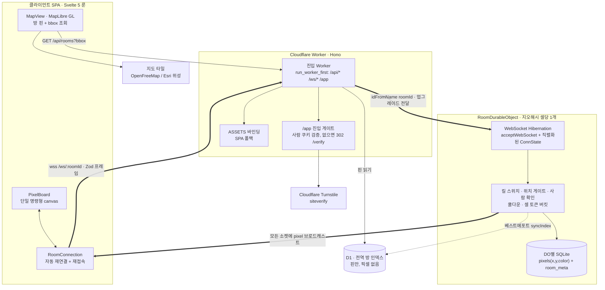

# Geo Pixel Board

[English](README.md) · **한국어**

**지구상의 모든 장소가 각자의 공동 픽셀 캔버스가 되는 세계 지도 — 그리고 당신이 실제로 서 있는 장소에서만 그릴 수 있습니다.**

누구나 지도를 둘러보며 픽셀 아트 낙서가 실시간으로 나타나는 것을 볼 수 있습니다. 하지만 보드에 *그리려면* 실제로 그곳에 있어야 합니다 — 서버가 모든 쓰기를 사용자의 실시간 위치로 검증합니다. 그 결과는 장소에 묶인 캔버스들의 지도입니다 — 지하철 출구, 캠퍼스 광장, 축제 거리 — 각각은 그곳에 직접 가는 사람만 편집할 수 있는 작은 공동 작품입니다.

제품 아이디어는 한 문장이지만, 흥미로운 부분은 *"쓰려면 그 자리에 있어야 한다"*를 실사용 환경에서 성립시키는 데 필요한 모든 것입니다: 서버 권위의 위치 게이트, **하이버네이션 WebSocket** 위의 실시간 프레즌스, 각자 임베디드 SQLite를 가진 **장소당 하나의 Durable Object**, 연결당 어뷰즈 스로틀링, 사람 확인, 그리고 단 하나의 원본 좌표도 저장하지 않는 프라이버시 설계.

🔗 **라이브 데모:** https://geo-pixel-board.kopserf.workers.dev
📦 **저장소:** https://github.com/macklinkim/geo_pixel_canvas

> 엣지 네이티브 · 완전 서버리스: SPA, REST API, WebSocket 팬아웃, 장소별 액터를 모두 **단일 Cloudflare Worker**가 서빙합니다 — 오리진 서버도, 컨테이너도, 별도 실시간 서비스도 없습니다.

---

## ✨ 한눈에 보기

- 🗺️ **장소 = 방.** 모든 지도 좌표는 정밀도 8 **지오해시 셀**로 결정적으로 변환되고, 각 셀이 *곧* 자신만의 **Cloudflare Durable Object**입니다 — 라우터 테이블 없는 콘텐츠 주소 기반 액터 샤딩.
- 📍 **위치 게이트가 걸린 쓰기.** 보기는 전 세계 누구나 가능하지만, 그리기는 **접속 시점과 모든 쓰기마다** 실시간 위치로 서버에서 재검증됩니다. 클라이언트의 비활성 버튼은 표시용일 뿐입니다.
- ⚡ **WebSocket Hibernation 기반 실시간.** 각 방이 자신의 라이브 소켓을 소유하며, 유휴 방은 픽셀·프레즌스·레이트리밋 상태를 잃지 않고 하이버네이트됩니다.
- 🧱 **방별 SQLite.** 픽셀은 각 DO의 자체 SQLite(`pixels(x,y,color)`)에 저장되고, **D1은 전역 핀 인덱스만** 보관합니다 — 픽셀 데이터는 D1에 닿지 않습니다.
- 🛡️ **공개 출시용 어뷰즈 방어.** 셀 단위 토큰 버킷, 킬 스위치, 입력 경계 검증, 이름 새니타이즈, 그리고 무상태 HMAC 세션 기반 Cloudflare Turnstile 사람 확인.
- 🔒 **설계로 보장하는 프라이버시.** 원본 `lat/lng`는 게이트 검증에만 쓰고 즉시 폐기 — 저장도 로깅도 하지 않습니다.

---

## 🧱 기술 스택

| 영역 | 기술 |
|---|---|
| **클라이언트** | Svelte 5 `^5.16.0` (**룬 전용**), MapLibre GL JS `^5.0.0`, 단일 명령형 `<canvas>` 보드 렌더러 |
| **엣지 / API** | Cloudflare Workers 위의 Hono `^4.6.15`, `@hono/zod-validator` `^0.4.2` |
| **실시간 + 상태** | **WebSocket Hibernation**을 쓰는 Cloudflare **Durable Objects** — 지오해시 방마다 DO 1개, 각자 임베디드 **SQLite** 보유 |
| **전역 인덱스** | Cloudflare **D1** (방/핀 메타데이터만 — 픽셀 없음) |
| **공유 코어** | 클라이언트와 워커가 *함께* import하는 순수 TypeScript: 지오해시 코덱, 하버사인, 위치 게이트, base64 스냅샷 코덱, Zod 프로토콜 |
| **검증** | WebSocket 양단 **과** REST 모두에서 Zod `^3.24.1` 구분 유니온(discriminated‑union) 프로토콜 |
| **사람 확인 / 어뷰즈** | Cloudflare Turnstile + HMAC‑SHA256 서명 `HttpOnly` 세션 쿠키 |
| **툴링** | Vite 6 `^6.0.7` + `@cloudflare/vite-plugin` `^1.0.0`, Wrangler `^4.0.0`, TypeScript `^5.7.2` (strict, `es2022`), pnpm 워크스페이스 (`pnpm@9.15.9`), `svelte-check` |
| **지도** | OpenFreeMap *positron* (키 불필요 벡터) + Esri World Imagery (키 불필요 위성) — 저작자 표시 유지, **지도 API 키 불필요** |

---

## 🏗 아키텍처

진입점은 단일 Hono Worker입니다. `run_worker_first`는 `/api/*`, `/ws/*`, `/app`만 Worker 코드로 보내고, 나머지는 `ASSETS` 바인딩이 정적 SPA 자산으로 서빙합니다. 모든 WebSocket 업그레이드는 해당 지오해시 방을 *소유한* Durable Object로 전달됩니다 — DO는 그 방의 픽셀·프레즌스·레이트리밋의 단일 진실원이자, 라이브 소켓을 보유하는 유일한 주체입니다.



### 픽셀 한 번 찍기, 처음부터 끝까지

1. 사용자가 보드 셀을 탭하면 `PixelBoard`가 포인터를 격자 셀로 매핑하고 *UX용* 게이트(쿨다운, 마지막 위치, 사람 확인 상태)를 확인합니다.
2. `RoomConnection`이 `wss://host/ws/:roomId`로 Zod 타입 `{ t:'paint', x, y, color, lat, lng, acc, token? }` 프레임을 보냅니다.
3. Worker는 이미 지오해시 `roomId`와 사람 세션 쿠키를 검증하고 업그레이드를 `ROOM.get(idFromName(roomId))`로 전달한 상태입니다.
4. DO 안에서 프레임은 전체 **권위 파이프라인**을 거칩니다: 크기 제한 → `JSON.parse` → Zod 파싱 → `WRITE_DISABLED` 킬 스위치 → 위치 게이트 → 사람 재확인 → 쿨다운 → 토큰 버킷 차감.
5. DO는 셀을 자체 SQLite에 upsert(`INSERT ... ON CONFLICT(x,y)`)하고 `serializeAttachment`로 연결 상태를 저장한 뒤, **모든 소켓에 `{t:'pixel'}`을 브로드캐스트**하고 그린 사람에게 ack를 보냅니다.
6. 실시간 경로가 끝난 *후에야* DO는 베스트에포트로 D1 `syncIndex`(픽셀 수, 마지막 그린 시각, 최초 등장 시 역지오코딩 이름)를 수행합니다 — 인덱스 지연이 라이브 브로드캐스트를 막는 일은 결코 없습니다.

---

## 🔍 동작 원리

**지오해시 방.** 좌표는 `shared/`에 직접 구현한 결정적 코덱으로 정밀도 8 지오해시로 인코딩되며, 클라이언트와 Worker가 *함께* import해 런타임 라이브러리에 의존하지 않고 양쪽이 동일한 방 id를 도출합니다. 그 지오해시가 곧 Durable Object 이름(`idFromName`)이라, 셀이 *곧* 액터입니다 — 할당 단계도, 조회 테이블도 없습니다.

**서버 측 위치 게이트.** 보기는 열려 있지만 쓰기는 그렇지 않습니다. 모든 쓰기는 사용자의 일시적 `lat/lng/acc`를 싣고, DO는 `checkLocationGate`(셀 중심까지의 하버사인 거리 + 정확도 상한)를 **접속 시점과 모든 paint·stamp·rename마다** 재실행합니다 — 접속할 때만이 아닙니다. 같은 게이트가 REST 방 생성도 보호합니다. DO가 권위이고, 클라이언트 UI는 힌트일 뿐입니다.

**실시간.** DO는 WebSocket Hibernation API로 방의 모든 소켓을 보유하므로, 유휴 방은 상태를 유지한 채 비용이 들지 않습니다. 새로 들어온 사람은 base64로 인코딩된 보드 스냅샷 1개(`BOARD_W × BOARD_H` 팔레트 인덱스 `Uint8Array`)를 받고, 이후로는 셀 단위 델타만 브로드캐스트되어 `fillRect` 한 번으로 적용됩니다.

---

## ⚙️ 엔지니어링 하이라이트

- **라우터 없는 DO‑방당 액터 모델.** 지오해시가 *곧* Durable Object id(`idFromName`)라, 방 샤딩이 콘텐츠 주소 기반이며 조회가 필요 없습니다 — 지구상 모든 셀이 정확히 하나의 일관된 단일 스레드 액터로 매핑됩니다.
- **연결 상태를 직렬화하는 WebSocket Hibernation.** 연결당 상태(세션 id, 쿨다운, 사람 확인 만료, 토큰 버킷 잔량)를 `serializeAttachment` / `deserializeAttachment`로 보존해, 방이 레이트리밋·사람 확인 상태를 잃지 않고 하이버네이트·웨이크합니다.
- **픽셀 저장소로서의 DO별 SQLite.** 각 방은 `PRIMARY KEY(x,y)` upsert를 쓰는 `pixels(x,y,color,updated_at)` 테이블을 소유하고, 스냅샷은 행들을 `EMPTY`로 채운 `Uint8Array`에 스캔해 만듭니다. D1은 의도적으로 전역 핀 인덱스 *전용*입니다.
- **셀 단위 토큰 버킷.** 펜 한 획은 1토큰, 다중 셀 스탬프는 `cells.length`(`버스트 1500`, `초당 300 충전`)를 소모합니다. 사람에게는 보이지 않으면서 스크립트성 보드 도배·스탬프 스팸을 억제 — 메시지당 레이트리밋보다 정직한 단위입니다. (100ms 쿨다운은 체감용이 아닌 보조 플러드 가드입니다.)
- **신뢰 경계 인증 핸드오프.** DO는 *오직* Worker를 통해서만 닿으므로, Worker가 `HttpOnly` 세션 쿠키를 검증하고 `humanUntil`을 업그레이드 URL로 넘깁니다 — 액터 안에서 쿠키 파싱을 중복하지 않습니다.
- **무상태 HMAC 세션.** 사람 세션은 Turnstile 시크릿으로 서명한 `${expiresMs}.${hmac}`이며, 길이 검증 + **상수 시간** 비교로 검증합니다 — 세션 테이블도, 세션 스토어도 없습니다.
- **심층 방어(defense‑in‑depth) 메시지 처리.** 모든 인바운드 프레임은 핸들러 실행 *전에* 파싱 전 바이트 크기 거부 → JSON `try/catch` → Zod 구분 유니온 파싱을 거칩니다.
- **인덱스가 실시간을 막지 않음.** 픽셀은 먼저 DO SQLite에 저장·브로드캐스트되고, D1 인덱스 동기화는 `try/catch` 안에서 fire‑and‑forget입니다.
- **지도 조회의 stale 응답 가드.** 디바운스된 bbox 방 조회에 단조 증가 시퀀스 번호를 실어, 느리게 도착한 `/api/rooms` 응답이 더 새로운 결과를 덮어쓰지 못하게 합니다.
- **렌더링 규율.** 보드는 `image-rendering: pixelated`로 CSS 스케일하는 단일 고정 해상도 `<canvas>`입니다(팬은 `translate`, 줌은 표시 너비 변경으로 최근접 보간 유지). 명령형 렌더러는 Svelte 바깥에 완전히 존재하며 `bind:this`로 연결됩니다 — Svelte는 UI 상태만 소유합니다.
- **엣지 캐시 정방향 지오코딩.** 주소 검색은 정규화된 쿼리를 키로 `caches.default`에 캐시하고 `waitUntil`로 기록해, Nominatim의 ~초당 1회 정책을 존중합니다.
- **철저한 룬 기반 Svelte 5.** 상태는 룬 클래스(`$state` / `$derived` / `$effect` / `$props`)로 모델링합니다; 레거시 `export let`, `$:`, 스토어 자동 구독은 어디에도 없습니다.

---

## 🔐 프라이버시 & 어뷰즈 저항

프라이버시는 정책이 아니라 데이터 모델 수준에서 강제됩니다:

- **원본 좌표는 절대 저장하지 않음.** 저장되는 유일한 위치 식별자는 지오해시 셀 id와 그로부터 파생된 셀 중심뿐입니다. 사용자의 `lat/lng/acc`는 일시적 WebSocket 프레임 안에만 존재하고, 게이트가 소비한 뒤 폐기됩니다.
- **원본 좌표 로깅 없음.** 로그에는 일반 경고만 있고, 코드베이스에 `console.log(lat, lng)`는 없습니다.
- **역지오코딩은 사용자 위치가 아닌 공개 셀 중심만 사용.**
- **시크릿은 서버에만.** `/api/config`는 공개 Turnstile 사이트 키만 노출하며, IP 처리를 피하려 Turnstile 호출에서 `remoteip`를 의도적으로 생략합니다.
- **강화된 사람 세션.** 쿠키는 `HttpOnly; SameSite=Lax; Secure`이고 만료 타임스탬프만 인코딩(좌표·IP·신원 없음), 상수 시간 HMAC 비교로 검증합니다.
- **모든 쓰기는 서버가 권위** — 킬 스위치 + 위치 게이트 + 사람 확인 + 쿨다운 + 토큰 버킷을 모든 paint/stamp/rename마다 재실행합니다.
- **입력 강화.** 경계가 있는 Zod 지오 필드(`lat -90..90`, `lng -180..180`, `acc 0..100k`), 과대 프레임 거부, 비‑JSON 거부, 그리고 DO를 띄우기 *전에* 정확한 지오해시 문자셋/길이 검증.
- **방 이름 새니타이즈** — C0/C1 제어문자, DEL, zero‑width/bidi 마크, BOM을 제거하고 공백을 정리하며 길이를 40자로 제한.
- **긴급 킬 스위치:** `WRITE_DISABLED` 환경변수로 재배포 없이 전체 쓰기를 즉시 차단.

---

## 🚀 로컬 실행

Node, `pnpm@9`, Wrangler가 필요합니다.

```bash
pnpm install

# 로컬 D1에 마이그레이션 적용 + 데모 방(서울역 인근) 시드
pnpm db:migrate:local
pnpm db:seed:local

# Vite + Cloudflare 플러그인: 클라이언트 HMR + Worker + Durable Object + 로컬 D1
pnpm dev          # http://localhost:5173 (점유 시 5174로 폴백)
```

개발 환경에서는 Turnstile이 항상 통과하는 Cloudflare 테스트 키를 씁니다. 데스크톱 지오로케이션은 IP 기반이라 부정확하므로, 그리기 경로를 시험하려면 셀 중심 좌표를 모킹하세요.

```bash
pnpm check        # 1차 품질 게이트: svelte-check + worker tsc + shared tsc
pnpm build        # 클라이언트 SPA + 워커 번들
pnpm format       # prettier (+ prettier-plugin-svelte)
```

## ☁️ 배포 (Cloudflare)

진입점 `worker/src/index.ts` (`compatibility_date 2025-09-01`, `nodejs_compat`). 바인딩: `ASSETS`(SPA), `DB`(D1), `ROOM`(Durable Object, 마이그레이션 태그 `v1`로 SQLite 기반).

```bash
# 1. D1 데이터베이스 생성 후 출력된 id를 wrangler.toml의 database_id에 붙여넣기
wrangler d1 create geo_pixel_board

# 2. 원격 데이터베이스에 마이그레이션 적용
pnpm db:migrate:remote

# 3. (선택) 실제 Turnstile 위젯으로 사람 확인 활성화
wrangler secret put TURNSTILE_SECRET_KEY   # + [vars]에 실제 TURNSTILE_SITE_KEY 설정

# 4. 빌드 + 배포 (주의: `deploy`는 pnpm 내장 명령과 겹치므로 반드시 `run`)
wrangler login
pnpm run deploy
```

지도 API 키는 필요 없습니다 — 타일은 키가 필요 없습니다(OpenFreeMap positron + Esri 위성).

---

## 📁 프로젝트 구조

```
geo_pixel_board/
├── shared/             # 클라이언트 + 워커가 공유하는 순수 TS (자체 tsconfig, @shared 별칭)
│   ├── constants.ts    #   보드 크기, 팔레트 버전, 게이트/제한 상수
│   ├── palette.ts      #   고정 32색 팔레트
│   ├── geo/            #   지오해시 코덱, 하버사인, 위치 게이트
│   ├── snapshot.ts     #   base64 보드 스냅샷 코덱
│   └── protocol.ts     #   Zod 구분 유니온 클라이언트/서버 메시지
├── worker/
│   ├── src/
│   │   ├── index.ts        # Hono 진입 Worker, /ws 업그레이드, /app 게이트
│   │   ├── rooms.ts        # REST: /api/rooms, /api/geocode, /api/verify, ...
│   │   ├── room-do.ts      # RoomDurableObject: WS 하이버네이션 + DO별 SQLite
│   │   ├── session.ts      # HMAC 세션 서명/검증 + 쿠키
│   │   ├── turnstile.ts    # Turnstile siteverify
│   │   └── geocode.ts      # Nominatim 역/정방향 지오코딩 (셀 중심만)
│   ├── migrations/         # D1: 0001_create_rooms.sql (전역 핀 인덱스)
│   └── seed.sql            # 데모 방
├── client/
│   └── src/
│       ├── App.svelte          # 3-라우트 pushState 라우터 (/ /verify /app)
│       ├── components/         # MapView, RoomPanel, PixelBoard, MiniMap, ...
│       └── lib/
│           ├── map/            # MapLibre 컨트롤러, 방 레이어, 베이스맵
│           ├── board/          # 명령형 BoardRenderer, 스탬프
│           ├── ws/             # roomSocket + reconnect (RoomConnection)
│           └── state/          # Svelte 5 룬 상태 클래스
├── wrangler.toml       # Worker, D1, Durable Object, assets, vars
├── vite.config.ts      # Vite 6 + @cloudflare/vite-plugin
└── pnpm-workspace.yaml
```

---

## 🧭 범위

집중된 v1입니다. 의도적으로 **범위에서 제외**(미구현): 계정/프로필, 리더보드, 어뷰즈 신고 & 모더레이션 대시보드, 소유자/장소 운영자 클레임, R2 보드 썸네일, 결제. 폭넓음보다 어려운 핵심 — 지리공간 접근 제어, 엣지 실시간, 어뷰즈 저항 — 을 우선했습니다.

---

*분산·엣지 네이티브 실시간 시스템에 대한 학습 프로젝트로 제작: 콘텐츠 주소 기반 액터 샤딩, 하이버네이션 WebSocket 팬아웃, 샤드별 임베디드 SQLite, 서버 권위의 지리공간 접근 제어.*
