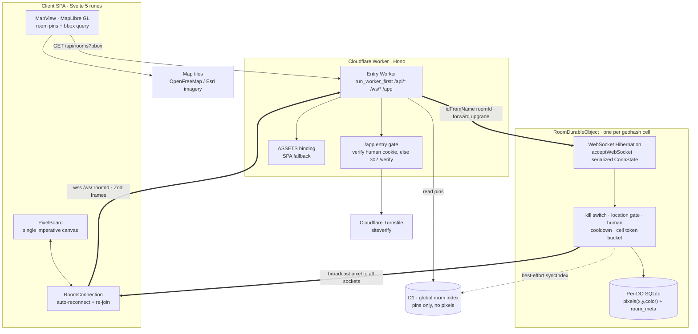

# Geo Pixel Board

**A world map where every place is its own collaborative pixel canvas — and you can only paint the places you physically stand in.**

Anyone can pan the globe and watch pixel‑art graffiti appear in real time. But to *draw* on a board you have to actually be there: the server gates every write on your live geolocation. The result is a map of place‑locked canvases — a subway exit, a campus quad, a festival square — each a small shared artwork that only the people who go there can edit.

The product idea is one sentence. The interesting part is everything required to make *"you must be here to write"* hold up under real users: a server‑authoritative location gate, realtime presence over **hibernating WebSockets**, **one Durable Object per place** with its own embedded SQLite, per‑connection abuse throttling, human verification, and a privacy posture that never stores a single raw coordinate.

🔗 **Live demo:** https://geo-pixel-board.kopserf.workers.dev
📦 **Repo:** https://github.com/macklinkim/geo_pixel_canvas

> Edge‑native and serverless end to end: deployed as a single Cloudflare Worker that serves the SPA, the REST API, the WebSocket fan‑out, and the per‑room actors — no origin server, no container, no separate realtime service.

---

## ✨ At a glance

- 🗺️ **Place = room.** Every map coordinate deterministically resolves to a precision‑8 **geohash cell**, and each cell *is* its own **Cloudflare Durable Object** — content‑addressed actor sharding with no router table.
- 📍 **Location‑gated writes.** Viewing is global and open; painting is re‑checked server‑side against your live position on **join and on every single write**. Client‑side disabled buttons are cosmetic only.
- ⚡ **Realtime over WebSocket Hibernation.** Each room owns its live sockets; idle rooms hibernate without losing pixel, presence, or rate‑limit state.
- 🧱 **Per‑room SQLite.** Pixels live in each DO's own SQLite (`pixels(x,y,color)`); **D1 holds only the global pin index** — pixel data never touches it.
- 🛡️ **Abuse‑hardened for public launch.** Cell‑denominated token bucket, kill switch, bounded inputs, name sanitization, and Cloudflare Turnstile human verification with stateless HMAC sessions.
- 🔒 **Privacy by construction.** Raw `lat/lng` are used for the gate check and then discarded — never stored, never logged.

---

## 🧱 Tech stack

| Layer | Technology |
|---|---|
| **Client** | Svelte 5 `^5.16.0` (**runes only**), MapLibre GL JS `^5.0.0`, a single imperative `<canvas>` board renderer |
| **Edge / API** | Hono `^4.6.15` on Cloudflare Workers, `@hono/zod-validator` `^0.4.2` |
| **Realtime + state** | Cloudflare **Durable Objects** with **WebSocket Hibernation** — one DO per geohash room, each with its own embedded **SQLite** |
| **Global index** | Cloudflare **D1** (room/pin metadata only — no pixels) |
| **Shared core** | Pure TypeScript imported by *both* client and worker: geohash codec, haversine, location gate, base64 snapshot codec, Zod protocol |
| **Validation** | Zod `^3.24.1` discriminated‑union protocol on both WebSocket ends **and** REST |
| **Humanity / abuse** | Cloudflare Turnstile + HMAC‑SHA256‑signed `HttpOnly` session cookie |
| **Tooling** | Vite 6 `^6.0.7` + `@cloudflare/vite-plugin` `^1.0.0`, Wrangler `^4.0.0`, TypeScript `^5.7.2` (strict, `es2022`), pnpm workspace (`pnpm@9.15.9`), `svelte-check` |
| **Maps** | OpenFreeMap *positron* (keyless vector) and Esri World Imagery (keyless satellite) — attribution retained, **no map API key required** |

---

## 🏗 Architecture

A single Hono Worker is the entry point. `run_worker_first` routes only `/api/*`, `/ws/*`, and `/app` through Worker code; everything else is served as static SPA assets by the `ASSETS` binding. Each WebSocket upgrade is forwarded to the Durable Object that *owns* that geohash room — the DO is the single source of truth for that room's pixels, presence, and rate limits, and the only thing holding its live sockets.



### A single paint, end to end

1. The user taps a board cell; `PixelBoard` maps the pointer to a grid cell and checks *UX‑only* gates (cooldown, last known position, human status).
2. `RoomConnection` sends a Zod‑typed `{ t:'paint', x, y, color, lat, lng, acc, token? }` frame over `wss://host/ws/:roomId`.
3. The Worker has already validated the geohash `roomId` and the human‑session cookie, and forwarded the upgrade to `ROOM.get(idFromName(roomId))`.
4. Inside the DO the frame runs the full **authoritative pipeline**: size limit → `JSON.parse` → Zod parse → `WRITE_DISABLED` kill switch → location gate → human re‑check → cooldown → token‑bucket consume.
5. The DO upserts the cell into its own SQLite (`INSERT ... ON CONFLICT(x,y)`), persists per‑connection state via `serializeAttachment`, then **broadcasts `{t:'pixel'}` to every socket** and acks the painter.
6. Only *after* the realtime path completes does the DO do a best‑effort D1 `syncIndex` (pixel count, last‑drawn, first‑sight reverse‑geocoded name) — index lag can never block the live broadcast.

---

## 🔍 How it works

**Geohash rooms.** A coordinate is encoded to a precision‑8 geohash by a hand‑rolled deterministic codec in `shared/`, imported by *both* client and Worker so both sides derive the identical room id without trusting a runtime library. That geohash is the Durable Object name (`idFromName`), so the cell *is* the actor — no allocation step, no lookup table.

**Server‑side location gate.** Reading is open; writing is not. Every write carries the user's transient `lat/lng/acc`, and the DO re‑runs `checkLocationGate` (haversine distance to the cell center + accuracy ceiling) on **join and on every paint, stamp, and rename** — never just at join. The same gate guards REST room creation. The DO is authoritative; the client UI is only a hint.

**Realtime.** The DO holds all room sockets via the WebSocket Hibernation API, so idle rooms cost nothing while retaining their state. A new joiner receives one base64‑encoded board snapshot (a `BOARD_W × BOARD_H` `Uint8Array` of palette indices); thereafter only per‑cell deltas are broadcast and applied as a single `fillRect`.

---

## ⚙️ Engineering highlights

- **DO‑per‑room actor model with no router.** The geohash *is* the Durable Object id (`idFromName`), so room sharding is content‑addressed and lookup‑free — every cell on Earth maps to exactly one consistent, single‑threaded actor.
- **WebSocket Hibernation with serialized connection state.** Per‑connection state (session id, cooldown, human‑verified‑until, token‑bucket level) is persisted via `serializeAttachment` / `deserializeAttachment`, so rooms hibernate and wake without losing rate‑limit or human‑verification state.
- **Per‑DO SQLite as the pixel store.** Each room owns a `pixels(x,y,color,updated_at)` table with `PRIMARY KEY(x,y)` upserts; snapshots are built by scanning rows into an `EMPTY`‑filled `Uint8Array`. D1 is deliberately *only* a global pin index.
- **Cell‑denominated token bucket.** A pen stroke costs 1 token; a multi‑cell stamp costs `cells.length` (`burst 1500`, `refill 300/s`). This throttles scripted board‑wipes and stamp‑spam while staying invisible to a human — a more honest unit than a per‑message rate limit. (The 100 ms cooldown is a secondary flood guard, not a felt limit.)
- **Trusted‑boundary auth handoff.** The DO is reachable *only* through the Worker, so the Worker validates the `HttpOnly` session cookie and passes `humanUntil` down via the upgrade URL — no duplicated cookie parsing inside the actor.
- **Stateless HMAC sessions.** A human session is `${expiresMs}.${hmac}` signed with the Turnstile secret and verified with a length‑checked **constant‑time** compare — no session table, no session store.
- **Defense‑in‑depth message handling.** Every inbound frame passes a pre‑parse byte‑size reject → JSON `try/catch` → Zod discriminated‑union parse *before* any handler runs.
- **Realtime never blocked by the index.** Pixels persist to DO SQLite and broadcast first; the D1 index sync is fire‑and‑forget in a `try/catch`.
- **Stale‑response guard on map queries.** Debounced bbox room fetches carry a monotonic sequence number so a slow in‑flight `/api/rooms` response can't clobber newer results.
- **Render discipline.** The board is a single fixed‑resolution `<canvas>` scaled by CSS with `image-rendering: pixelated` (pan via `translate`, zoom via display width to keep nearest‑neighbor crisp). The imperative renderer lives entirely outside Svelte and is bridged via `bind:this` — Svelte owns only UI state.
- **Edge‑cached forward geocoding.** Address search is cached on `caches.default` keyed by normalized query with `waitUntil` write‑back, respecting Nominatim's ~1 req/s policy.
- **Strictly runes‑based Svelte 5.** State is modeled with rune classes (`$state` / `$derived` / `$effect` / `$props`); no legacy `export let`, `$:`, or store auto‑subscription anywhere.

---

## 🔐 Privacy & abuse resistance

Privacy is enforced at the data‑model level, not by policy:

- **Raw coordinates are never persisted.** The only stored geo identifier is the geohash cell id and its derived cell center. A user's `lat/lng/acc` exist only inside transient WebSocket frames, are consumed by the gate, and discarded.
- **No raw coordinate logging.** Logs carry only generic warnings; there is no `console.log(lat, lng)` in the codebase.
- **Reverse geocoding uses the public cell center, never the user's fix.**
- **Secrets stay server‑side.** `/api/config` exposes only the public Turnstile site key; `remoteip` is intentionally omitted from Turnstile calls to avoid handling IPs.
- **Hardened human session.** The cookie is `HttpOnly; SameSite=Lax; Secure`, encodes only an expiry timestamp (no coordinates, IP, or identity), verified with a constant‑time HMAC compare.
- **Server is authoritative for all writes** — kill switch + location gate + human check + cooldown + token bucket re‑run on every paint/stamp/rename.
- **Input hardening.** Bounded Zod geo fields (`lat -90..90`, `lng -180..180`, `acc 0..100k`), oversized‑frame rejection, non‑JSON rejection, and exact geohash charset/length validation *before* a DO is ever spun up.
- **Room‑name sanitization** strips C0/C1 controls, DEL, zero‑width/bidi marks, and BOM, collapses whitespace, and caps length at 40.
- **Emergency kill switch:** a `WRITE_DISABLED` env flag instantly disables all writes fleet‑wide, no redeploy.

---

## 🚀 Run locally

Requires Node, `pnpm@9`, and Wrangler.

```bash
pnpm install

# Apply D1 migrations + seed demo rooms (near Seoul Station) to the LOCAL D1
pnpm db:migrate:local
pnpm db:seed:local

# Vite + Cloudflare plugin: client HMR + Worker + Durable Object + local D1
pnpm dev          # http://localhost:5173 (falls back to 5174 if occupied)
```

In dev, Turnstile uses Cloudflare test keys that auto‑pass. Desktop geolocation is coarse/IP‑based, so mock a location at a cell center to exercise the draw path.

```bash
pnpm check        # primary quality gate: svelte-check + worker tsc + shared tsc
pnpm build        # client SPA + worker bundle
pnpm format       # prettier (+ prettier-plugin-svelte)
```

## ☁️ Deploy (Cloudflare)

Entry point `worker/src/index.ts` (`compatibility_date 2025-09-01`, `nodejs_compat`). Bindings: `ASSETS` (SPA), `DB` (D1), `ROOM` (Durable Object, SQLite‑backed via migration tag `v1`).

```bash
# 1. Create a D1 database and paste its id into wrangler.toml (database_id)
wrangler d1 create geo_pixel_board

# 2. Apply migrations to the remote database
pnpm db:migrate:remote

# 3. (optional) enable human verification with a real Turnstile widget
wrangler secret put TURNSTILE_SECRET_KEY   # + set a real TURNSTILE_SITE_KEY in [vars]

# 4. Build + deploy the Worker (note: `run`, since `deploy` is a pnpm built-in)
wrangler login
pnpm run deploy
```

No map API key is required — tiles are keyless (OpenFreeMap positron + Esri imagery).

---

## 📁 Project structure

```
geo_pixel_board/
├── shared/             # Pure TS shared by client + worker (own tsconfig, @shared alias)
│   ├── constants.ts    #   board dims, palette version, gate/limit constants
│   ├── palette.ts      #   fixed 32-color palette
│   ├── geo/            #   geohash codec, haversine, location gate
│   ├── snapshot.ts     #   base64 board snapshot codec
│   └── protocol.ts     #   Zod discriminated-union client/server messages
├── worker/
│   ├── src/
│   │   ├── index.ts        # Hono entry Worker, /ws upgrade, /app gate
│   │   ├── rooms.ts        # REST: /api/rooms, /api/geocode, /api/verify, ...
│   │   ├── room-do.ts      # RoomDurableObject: WS hibernation + per-DO SQLite
│   │   ├── session.ts      # HMAC session sign/verify + cookie
│   │   ├── turnstile.ts    # Turnstile siteverify
│   │   └── geocode.ts      # Nominatim reverse/forward geocode (cell center only)
│   ├── migrations/         # D1: 0001_create_rooms.sql (global pin index)
│   └── seed.sql            # demo rooms
├── client/
│   └── src/
│       ├── App.svelte          # 3-route pushState router (/ /verify /app)
│       ├── components/         # MapView, RoomPanel, PixelBoard, MiniMap, ...
│       └── lib/
│           ├── map/            # MapLibre controller, room layer, basemaps
│           ├── board/          # imperative BoardRenderer, stamps
│           ├── ws/             # roomSocket + reconnect (RoomConnection)
│           └── state/          # Svelte 5 rune state classes
├── wrangler.toml       # Worker, D1, Durable Object, assets, vars
├── vite.config.ts      # Vite 6 + @cloudflare/vite-plugin
└── pnpm-workspace.yaml
```

---

## 🧭 Scope

This is a focused v1. Intentionally **out of scope** (and not implemented): accounts/profiles, leaderboards, abuse‑report & moderation dashboards, owner/venue claims, R2 board thumbnails, and payments. The build prioritizes the hard core — geospatial access control, edge realtime, and abuse resistance — over breadth.

---

*Built as a study in distributed, edge‑native realtime systems: content‑addressed actor sharding, hibernating WebSocket fan‑out, per‑shard embedded SQLite, and server‑authoritative geospatial access control.*
